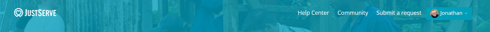

# Proposal: Modernize JustServe Help Center UI

## Issue Summary

The current user interface (UI) of the Zendesk Help Center does not match the branding and styling of the main JustServe.com website. This creates an inconsistent user experience.

### Example
- Current Help Center Banner:

- Current JustServe.com Banner:

## Proposed Solution
Update styling through Help Center to align with the standard JustServe site. 

## Scope of Changes

### Files to Change
The entire UI implementation will be replaced with a new implementation. That is to say that we will be deploying by our own fork of the [Copenhagen] repo provided by zendesk. The files changed within this new repo will be the styling and templating files (e.g., `_buttons.scss`, `header.hbs`, `article_page.hbs`). Additional javascript libraries may be added if needed (e.g., mermaid.js for flow charts, etc.)

### System Impact
#### Anticipated Downtime
No downtime is anticipated. We have a sandbox in zendesk where we can preview and test these changes prior to release. Zendesk is also able to publish updates without impacting the operational status of the Help Center. This is something that is currently performed regularly when updates from our current template are made.

##### Comprehensive Testing

CI/CD testing will provide confidence that everything works as expected any time the codebase is edited. These tests run whether the change came from our edits or from syncing our codebase with the original copenhagen template.
- Smoke tests with [Lighthouse] 
    - Validate all (15) vanity URL's
- Integration Testing with [Jest]
- Manually validating deployment within a sanboxed zendesk environment
----
##### Rollback Plan
In the unlikely event that something does break despite the thorough testing, the below plan will be made available for the business team to implement in order to recover a working zendesk environment within minutes:

<ol><li> Find commit hash for the latest working iteration of the zendesk theme

> call <code>git log --oneline</code> to view the latest few commits. releases should be squashed and merged, so the last commit should be the only one that is broken
</li>
<li>Branch off of main

> call <code>git checkout -b "fix/breaking-version\<theme-version></code> to create this branch unique to this fix. 
</li>
<li>Revert the last commit

> call <code>git reset --hard \<git commit sha from step 1></code> or, if the breaking change is contained in a single commit as expected, you can do this same thing with <code>git reset --hard HEAD~1</code></li>
<li>Increment the release version</li>
<li>Create and Finish PR from new branch on top of main</li>
<li> Update Zendesk with new UI
</li>
</ol>

-----

#### Maintenance 
Continued maintenance will continue as it has currently been in place, receiving updates from the source template. Any other edits are made on a case-by-case basis

#### Impact on Development Team:
No time will be required from the development team in any way to implement these changes. 

[Copenhagen]:https://support.zendesk.com/hc/en-us/articles/4408845834522-Using-the-standard-Copenhagen-theme-in-your-help-center
[Lighthouse]:https://developer.chrome.com/docs/lighthouse/overview
[Jest]:https://jestjs.io/